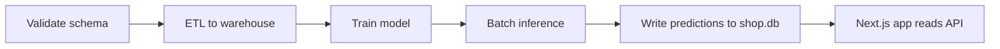

# Late Delivery Prediction ML Pipeline

End-to-end ML system that predicts which orders are likely to be delivered late. The project includes data validation, ETL into a warehouse table, model training, batch inference, and a Next.js UI for exploring results.

**Project Snapshot**
- Goal: predict late deliveries to help operations prioritize at-risk orders.
- Data: SQLite operational DB (`data/shop.db`) plus a derived warehouse (`data/warehouse.db`).
- Output: predictions stored in `order_predictions` and surfaced in the web app.
- Stack: Python, pandas, scikit-learn, SQLite, Next.js, AWS SAM (Lambda, EventBridge, S3, API Gateway).

**Architecture**


Pipeline entrypoint: `jobs/run_scheduled_pipeline.py`
- `jobs/1_validate_schema.py` checks the operational DB before ETL.
- `jobs/2_etl_build_warehouse.py` builds `fact_orders_ml` in `warehouse.db`.
- `jobs/3_train_model.py` trains and saves model artifacts in `artifacts/`.
- `jobs/4_run_inference.py` scores unfulfilled orders and writes predictions.

**Quick Start (Local)**
1. Install Python dependencies:
   ```bash
   pip install -r requirements.txt
   ```
2. Run the pipeline once:
   ```bash
   python3 jobs/run_scheduled_pipeline.py
   ```
3. Start the app with the local API server:
   ```bash
   cd app
   cp .env.local.example .env.local
   npm install
   npm run dev:all
   ```
4. Open `http://localhost:3000`.

**Repository Map**
- `jobs/` pipeline steps (validation, ETL, training, inference).
- `jobs/features.py` shared feature engineering used by ETL and inference.
- `data/shop.db` operational database.
- `data/warehouse.db` analytical warehouse with `fact_orders_ml`.
- `artifacts/` trained model, metadata, and metrics JSON.
- `app/` Next.js UI and local API server.
- `lambdas/` AWS Lambda handlers for API and pipeline.
- `template.yaml` AWS SAM infrastructure for API, pipeline, and scheduler.
- `DEPLOY.md` cloud deployment steps.
- `CRON_SETUP.md` local scheduling guide.
- `COST_CONTROL.md` cost notes for AWS resources.

**Model Details**
- Model: scikit-learn `LogisticRegression` inside a pipeline with imputation and scaling.
- Thresholding: tuned for high recall on late deliveries (minimizing false negatives).
- Artifact: `artifacts/late_delivery_model.sav` (trained pipeline)
- Artifact: `artifacts/model_metadata.json` (features, threshold, timestamps)
- Artifact: `artifacts/metrics.json` (evaluation metrics)

**ML Design Choices (For Students)**
- **Problem framing**: binary classification where `late_delivery = 1` means the shipment arrived late. The pipeline predicts this class for *unfulfilled* orders so ops can prioritize.
- **Train/serve parity**: feature engineering lives in `jobs/features.py` and is used by both ETL and inference to prevent training-serving skew.
- **Feature rationale**:
  - Order size/price signals: `num_items`, `total_value`, `avg_product_cost`, `num_distinct_products`.
  - Timing signals: `order_dow`, `order_month`, `order_hour`.
  - Customer signals: `customer_age`, `customer_order_count`.
  - Cost signal: `shipping_fee`.
- **Model choice**: logistic regression is fast, interpretable, and works well for tabular features; it’s a solid baseline for a production pipeline.
- **Imputation + scaling**: median imputation handles missing values; standard scaling keeps coefficients comparable and stabilizes optimization.
- **Evaluation split**: 75/25 train/test split with `stratify=y` to preserve class balance.
- **Threshold strategy (cost-sensitive)**:
  - Business goal: **high recall** on late deliveries (avoid missing late orders).
  - Target recall: `0.90` for class 1 with minimum precision `0.10`.
  - Threshold search grid: `0.10` → `0.90` in `0.05` steps.
  - If target recall is unreachable, the highest recall with acceptable precision is chosen.
- **Metrics reported**:
  - Default threshold (0.5): accuracy, F1, ROC AUC, full classification report.
  - Chosen threshold: precision/recall by class, F2 (recall-heavy), confusion matrix.

**Feature Set**
`num_items`, `total_value`, `avg_product_cost`, `customer_age`, `customer_order_count`,
`order_dow`, `order_month`, `order_hour`, `shipping_fee`, `num_distinct_products`

**App Features**
1. Select a customer and view their order history.
2. Place new orders (stored in `shop.db`).
3. View the late-delivery priority queue.
4. Run scoring to refresh predictions.

**Scheduling and Deployment**
- Local cron: see `CRON_SETUP.md`.
- AWS deployment: see `DEPLOY.md`.
- Cloud scheduler runs daily at 1:00 AM UTC via EventBridge.

**Suggested Walkthrough (Students)**
1. Start at `jobs/run_scheduled_pipeline.py` to see the orchestration flow.
2. Review `jobs/features.py` to understand feature parity between ETL and inference.
3. Read `jobs/2_etl_build_warehouse.py` and compare to `jobs/4_run_inference.py`.
4. Inspect `jobs/3_train_model.py` for evaluation metrics and threshold logic.
5. Open `app/src/` to see how predictions are surfaced in the UI.

**Notes for Recruiters**
- The pipeline is fully reproducible from raw operational data to predictions.
- Training and inference share feature logic to avoid training-serving skew.
- The system is deployable as a serverless stack with a daily schedule.
- The UI provides an operational workflow, not just a model demo.

If you want a deeper walkthrough or a demo script, let me know.
